# Desafío

La aplicación consta de tres componentes principales: la caja de búsqueda, la visualización de resultados, y la descripción del detalle del producto.

Cliente: HTML, JS (React), CSS (Sass)
Servidor: Node.js, Express

# Resultado

[Video](https://youtu.be/7f_ewG5KUAk)

# Desarrollo

## User Story Map

Para tener un orden y contar con una visión más amplia del proyecto, cree un mapa de historias de usuario
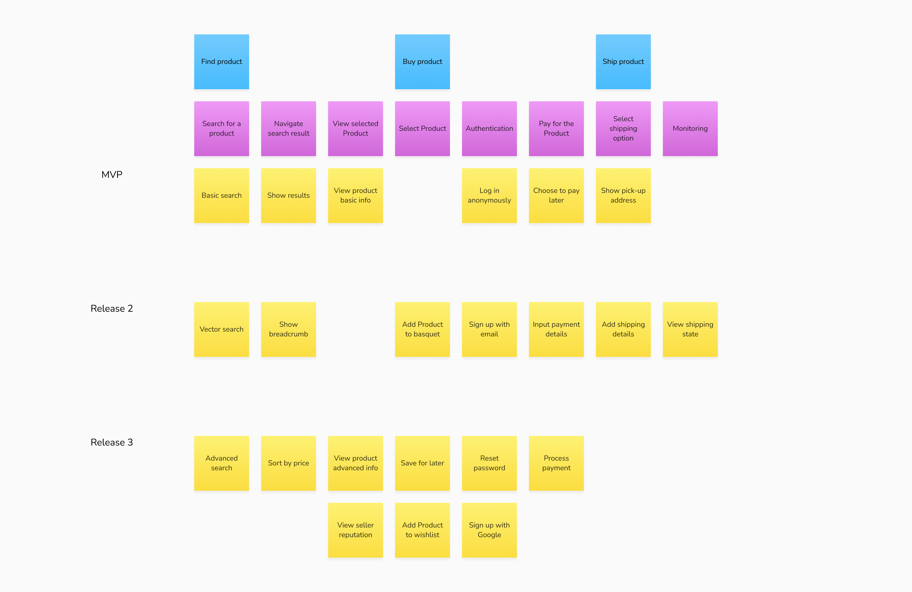
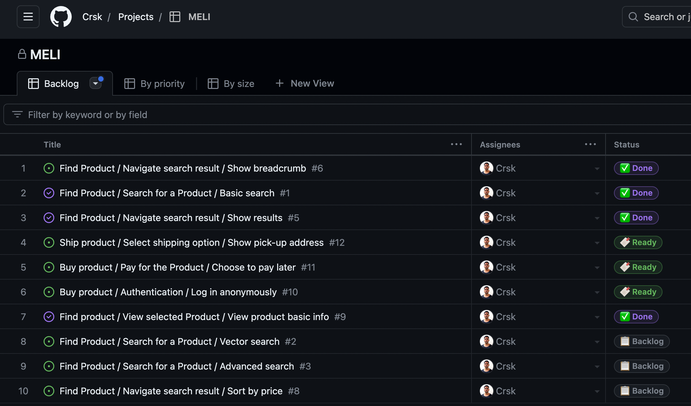
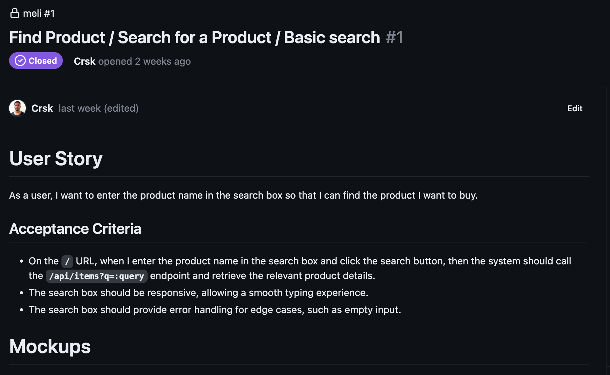

---

## Estructura de carpetas

Hice un mono repo con `Lerna Nx`

```markdown
Root
├── Server
│ └── src
│ ├── controllers # controla el request y response
│ ├── middlewares # tengo 2, el de firma y otro para retornar error 500 y evitar algo de try-catch
│ ├── routes # enruta al controlador
│ ├── services # trae los datos
│ ├── types # server utility types
│ └── utils # server utility functions
├── shared
│ └── src
│ ├── abstracts # color, tipografía, tamaños
│ ├── category # source models, new models, factory
│ ├── item # source models, new models, factory
│ ├── types # tipos compartidos entre proyectos, como la respuesta del backend al frontend
│ └── utils # round, get-two-decimals, etc
├── ui-kit
│ └── src
│ └── components # Badge, Button, Icon, Image, Logo, ItemCard, Rating, SearchBar, etc...
└── web
└── src
├── api # obsoleto, ignorar por favor, lo moví a store manejado por redux toolkit query
├── components #
├── contexts # solo uso el contexto de tema, storybook me evita la creación de contextos
├── pages # home, search result, item details
└── store # aquí va el state management, por ahora solo está el async state management
```

## Estilo de commits

Utilicé semantic commit messages y ramas para los features con mezcla por PR aunque fue raro porque estoy solo 🤷🏿‍♂️
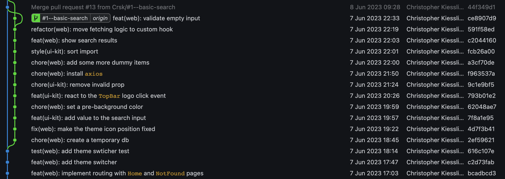

# Diseño

## Mockups

Tanto los mockups en Figma como los componentes en Storybook tienen soporte a Dark y Light mode

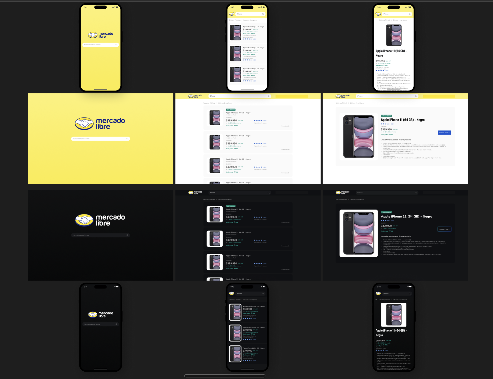

## Logo

vi que en el website oficial no tienen el logo vectorizado, hice una búsqueda rápida y recordé que me gusta ilustrar así que aproveché la oportunidad, igualito no?

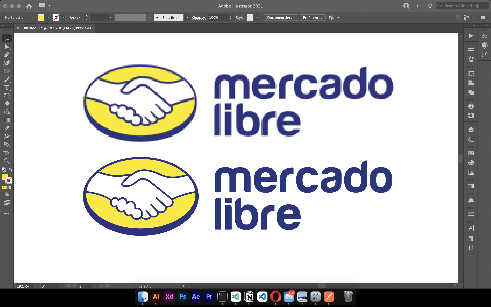

## Atomic Design

Me basé en los principios de atomic design para estructurar la librería de componentes, me ayudé de Storybook para probarlos

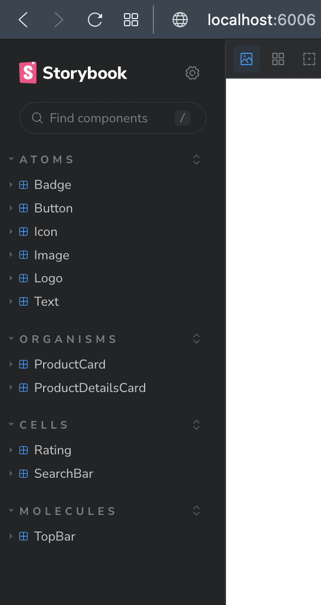

hablando de probar, escribí los test de los componentes con `React Testing Library` y `Vitest`, aunque en backend y shared library los configuré con `Jest`

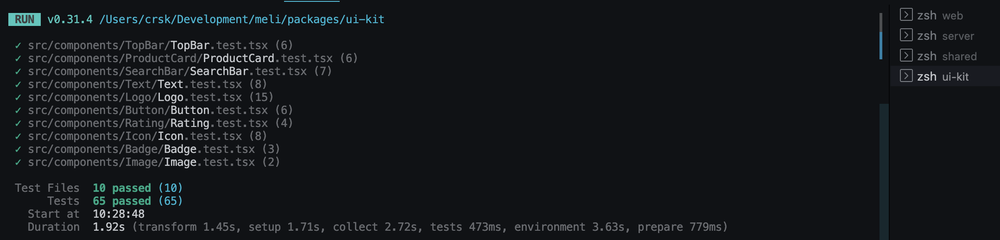


## Especificaciones

Creé una base de lineamientos, no es un design system pero algo así

para la paleta de colores, me basé en las especificaciones de WCAG para contraste y accesibilidad

están disponibles como sass variables en shared/abstracts, internamente lo usan los componentes de `ui-kit`, por ejemplo:

```html
<Text color="”green”" theme="”dark”" level="tertiary">some text</Text> // verde claro baja opacidad
<Text color="”green”" theme="”light”" level="primary">some text</Text> // verde oscuro alta opacidad
```

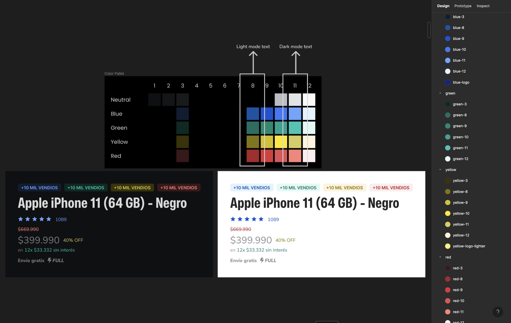

Así definí los niveles de opacidad

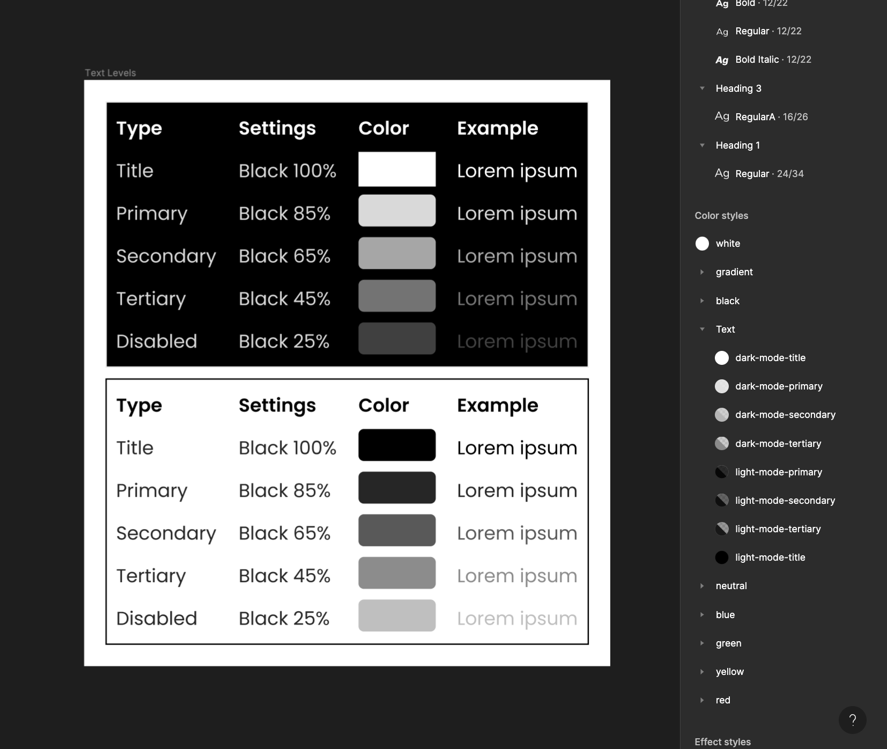

Se puede jugar con las combinaciones desde el storybook

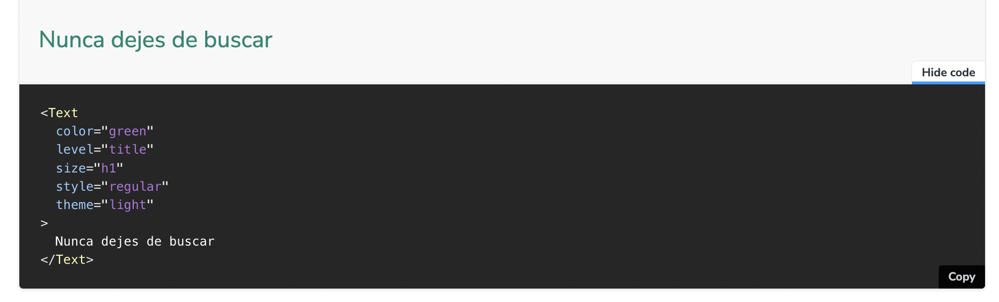

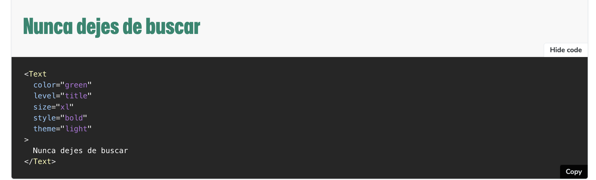

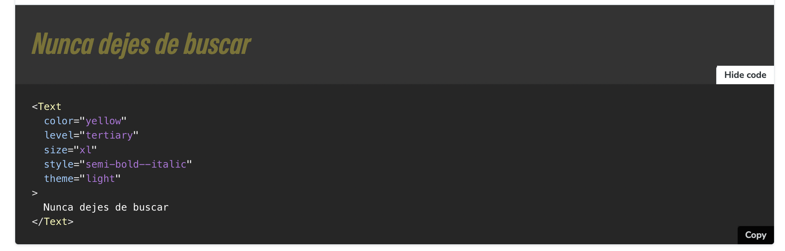

Utilizo 2 fuentes según el tamaño del texto, una fuente más contraída para el texto grande

Fuente no contraída, algo así quedaría:

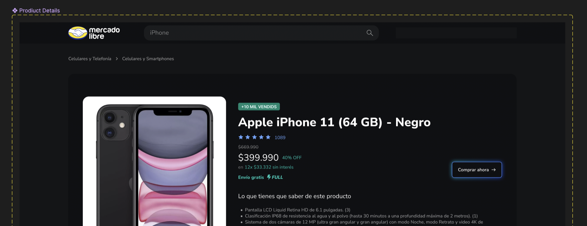

Fuente contraída, así lo dejé:

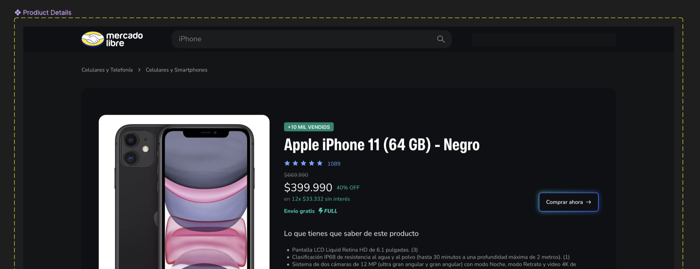

Para el cambio de fuente utilicé Sass como se pidió, aquí un ejemplo con el componente de texto

```sass
// esto está en shared/abstracts
@mixin font-family($font-type) {
  @if $font-type == 'condensed' {
    font-family: $font-family-condensed;
    font-stretch: condensed;
  } @else {
    font-family: $font-family-regular;
    font-stretch: normal;
  }
}

// esto está en ui-kit/text-component
.text {
  @include font-family('regular');
  @each $size, $value in $font-sizes {
    &--#{$size} {
      font-size: $value;

      @if $size == xl or $size == xxl {
        @include font-family('condensed');
      }
    }
  }

  @each $color, $themes in $color-map {
    @each $theme, $levels in $themes {
      @each $level, $color-value in $levels {
        &--#{$color}--#{$theme}--#{$level} {
          color: $color-value;
        }
      }
    }
  }
}
```

# Desafíos

## Decimal

En algunos países como en Argentina, los precios pueden tener decimal, el delimitador también varía según la región.

Esto no lo controlé del todo, ya que podría requerir de más tiempo, pero dejé una base usando `Intl` el cual es nativo de Javascript y se encarga del formateo de número según la región


también antepuse un cero como string ya que Javascript transforma 06 a 6, si guardo 0005 en una variable, este valor pasa a ser 5.

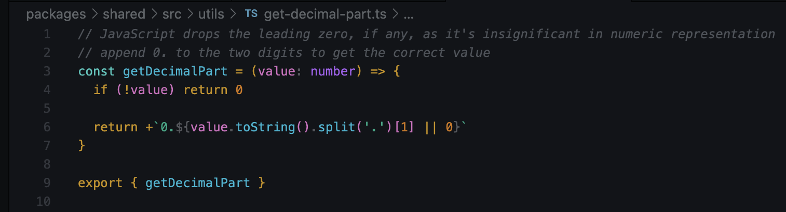

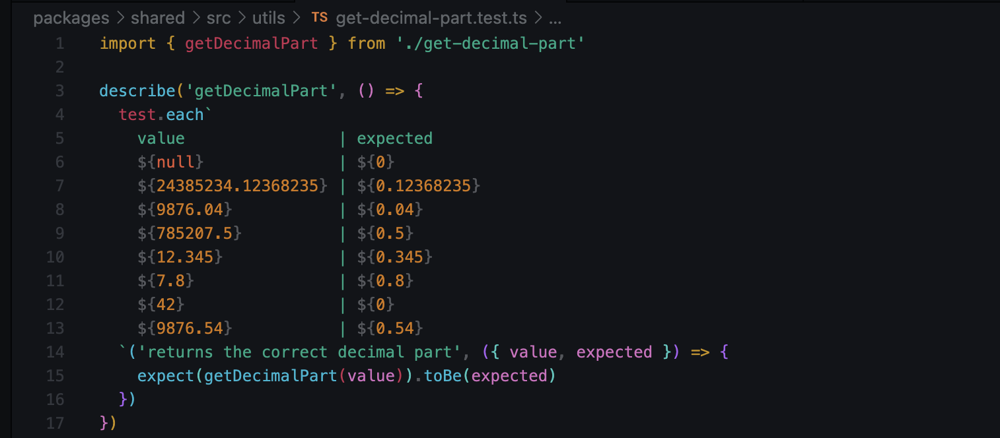

Aquí lo pruebo en postman

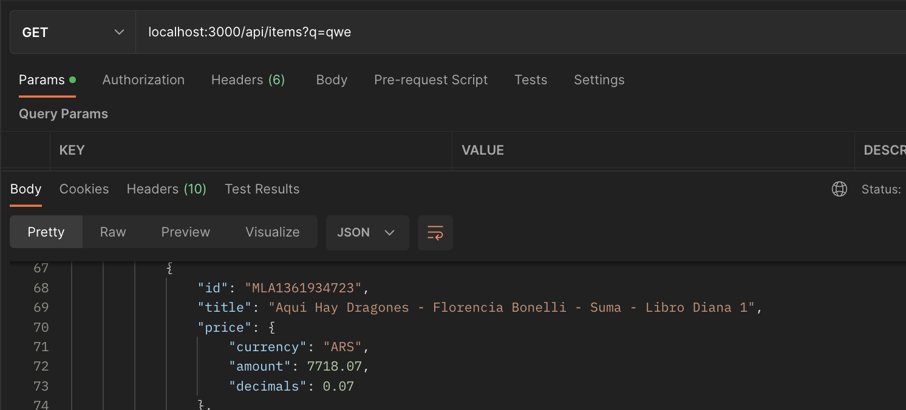

## OOP vs Functional

Para la construcción de entidades escogí un patrón de diseño `functional composition` sobre `OOP inheritance`, principalmente porque es mucho más modular y está de moda ir funcional por la vida. Si quiero construir algo solo debo tomar las partes que me interesan, en el ejemplo abajo me interesa el item general y su descripción.

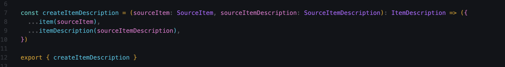

## API snake_case, Javascript camelCase

Los tipo de datos que comienzan con Source, por ejemplo `SourceItem`, son tipo de datos provenientes desde el endpoint de producción, los tengo tipado en camelCase, cuando los recibo los identifico como `SnakeCase<SourceSomethig>` y utilizo un utility function para pasarlo a camelCase. Entonces en el caso de ItemDescription existen 3 tipos:

- `SnakeCase<SourceItemDescription>` es el que viene de producción,
- `SourceItemDescription` es el de producción pero en camelCase listo para ser tratado por JS
- `ItemDescription` es el nuevo tipo, el que la nueva API provee

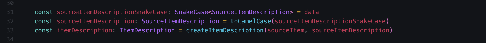

## Categorias

Me di cuenta de que al usar el endpoint de búsqueda, este -a veces- arroja resultados con un filtro de category ya aplicado, solo si la categoría encontrada es obvia, por ejemplo si busco “iphone” se aplica el filtro de category: teléfonos, en cambio si busco pelota no se aplica ningún filtro pero puedo buscar la moda desde la lista de `available_filters` cuyo integrante id es `category`

Agregué la propiedad `mostPopularCategory` ya que `categories` es del tipo `string[]` y al decidir filtrar repetidos perdí el conteo desde el front para conocer al más-repetido.

Otras posibles soluciones habrían sido:

- Cambiar el tipo de `categories` de `string[]` a algo como `{ name: string, results: number }[]` para llevar un conteo
- No filtrar repetidos (opción flayte), así el cliente front-end habría podido contar para llegar al más repetido

```tsx
type PopularCategory = {
  name: string // most popular category from available categories or applied category filter
  pathFromRoot: PathFromRoot | null // most popular categories path from applied category filter. null if no filter applied
}
```

Entonces creé un tipo `InferedCategory`

```tsx
type InferedCategory = { categories: string[]; popularCategory: PopularCategory | null }
```

el cual almacena categoría según 1 de 3 posibles escenarios:

1. la respuesta del endpoint viene con filtro de categoría, lo llamo `categoriesFromApliedFilter`
2. la respuesta del endpoint viene con `categoriesFromAvailableFilters`
3. ninguno de los anteriores, entonces se obtiene iterando los items en la respuesta del endpoint, lo llamo `categoriesFromItems`

Creo que el test lo explica mejor

### Caso 1

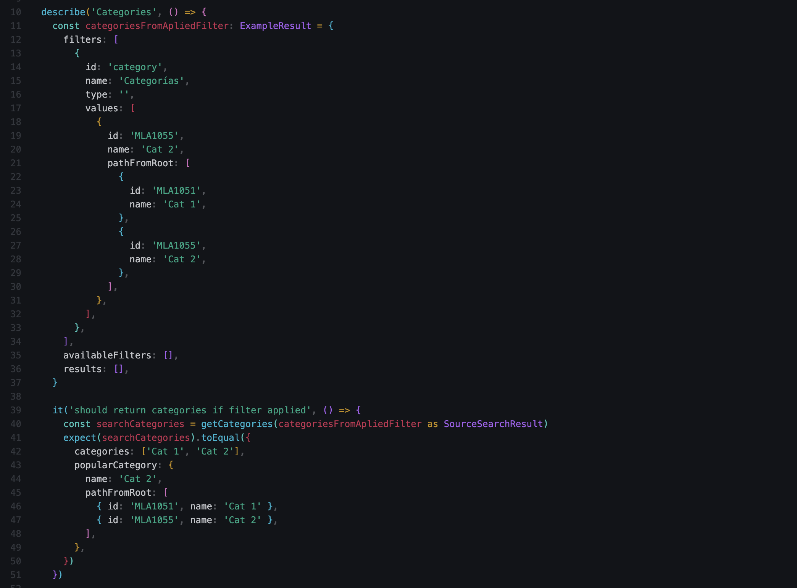

Aclaración: si el usuario busca algo con categoría obvia, el backend en producción `(https://api.mercadolibre.com/…)` retorna un filtro ya seleccionado si que el usuario haya filtrado `(filters: [...])`, entonces mi método `getCategories` retorna un objeto que contiene categorías como `string[]` y popularCategory el cual contiene `pathFromRoot`

### Caso 2

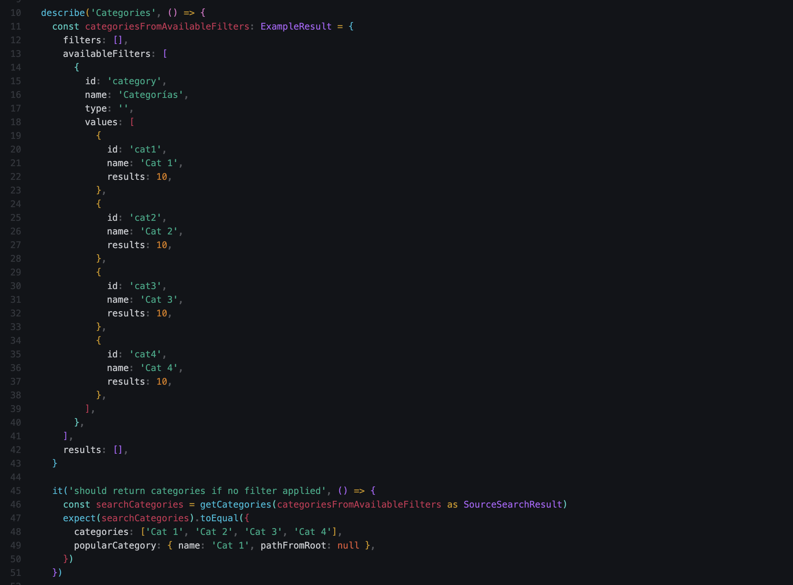

Aclaración: el usuario no buscó algo con categoría obvia, entonces no se aplicó un filtro, pero se lleno una lista de availableFilters en donde uno de ellos tiene el id `category`, este objeto tiene values de donde puedo extraer la lista de categorías

### Caso 3

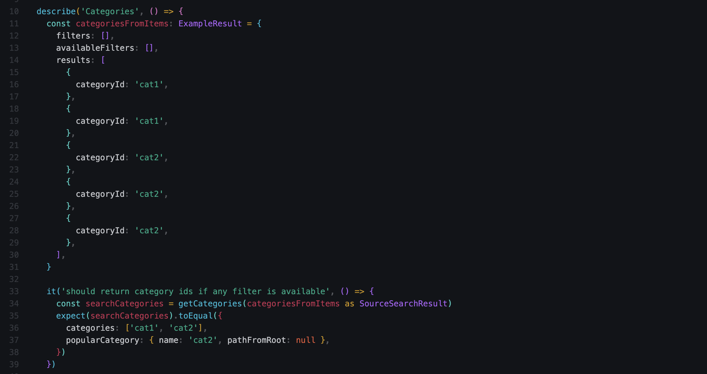

Aclaración: no sé si el caso 3 sea posible en algún escenario, ya que supongo que availableFilters siempre entregará información ya que mientras la búsqueda contenga al menos un resultado, de todas maneras dejé una alternativa a obtención de categorías, el problema de esta opción es que no es consistente al obtener los ids de las categorías mientras las otras opciones proveen del nombre, esta opción requiere de un tratamiento posterior pero lo más preocupante es que es propenso a errores debido a la inconsistencia, lo dejo a modo de ejemplo.

Entonces el nuevo endpoint retorna las categorías en arreglo de string como fue solicitado, además de un campo llamado `popularCategory` el cual tiene un `pathFromRoot` que se llena solo si se cumple el caso 1

### Probando respuesta API caso 1

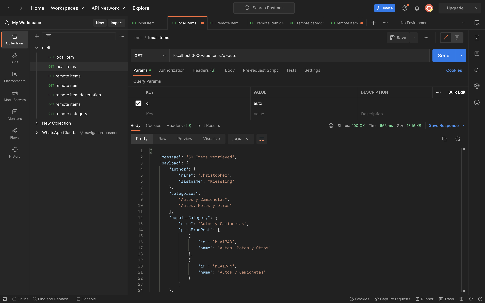

### Probando respuesta API caso 2

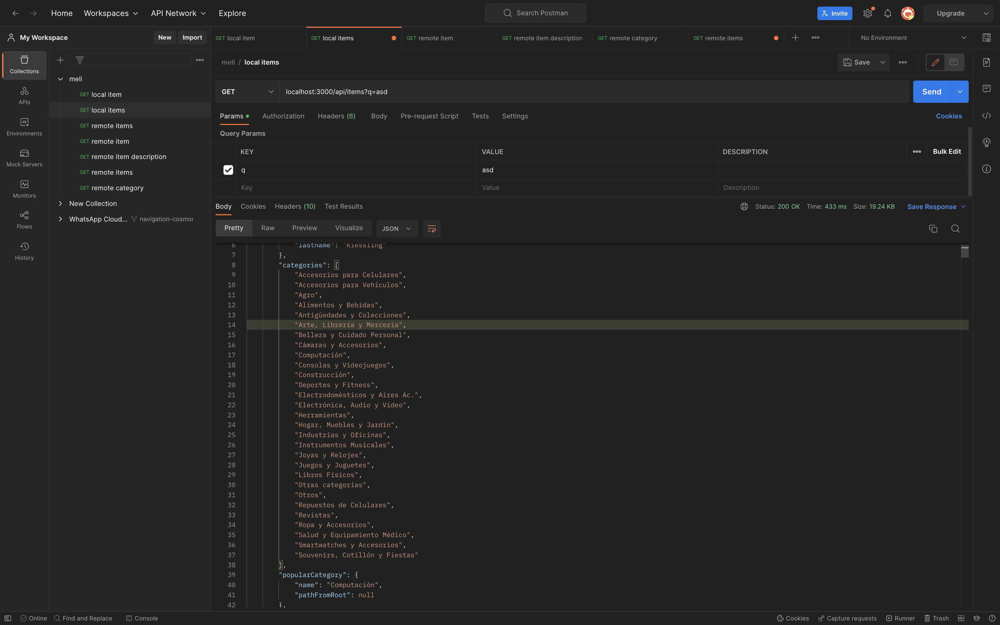

### Resultado

Buscando una pelota

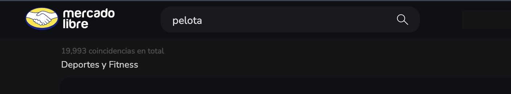

Entrando a una pelota

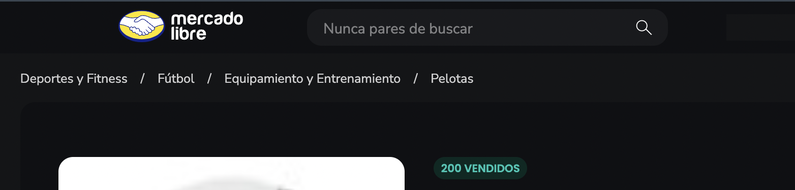

También el path de una categoría puede venir desde la búsqueda, ejemplo buscando una campera (polerón en Argentina).

(Aquí se aprecia el beneficio de no reinventar la rueda armando un nuevo contador de categoría 🙂)

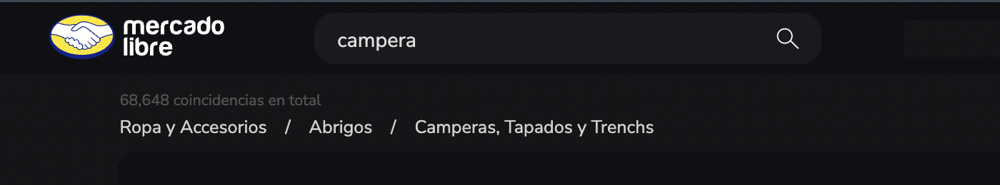

## Número de coincidencias

A pesar de mostrar 4 resultados, incluí la información de coincidencias en header X-Total-Count, para mayor información al usuario


Network tab en DevTools muestra que llega el header con la información de resultados

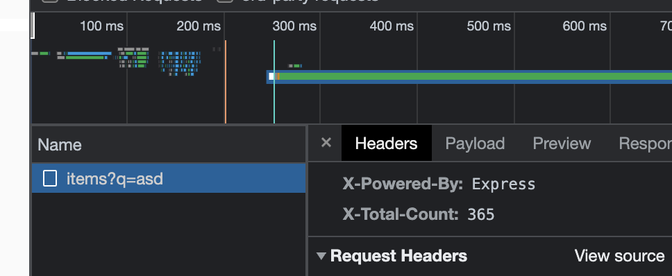

## Firma

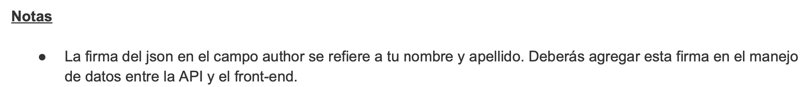

Ya que dice “entre la API y el front-end”, lo más “entre” que se me ocurrió fue firma desde un middleware de salida de API response (en vez de firmar en el controlador del backend)

# Resultado final

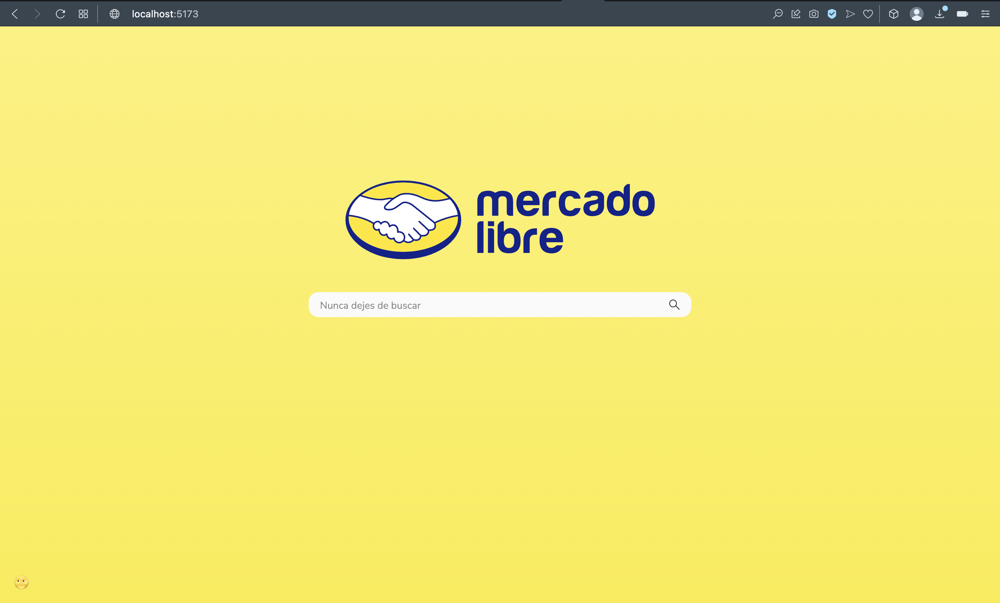

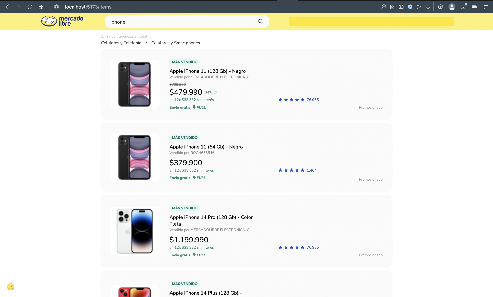

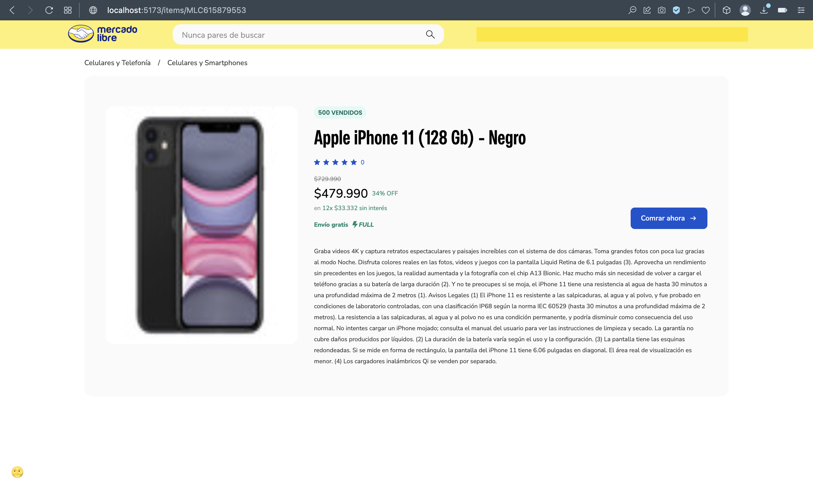

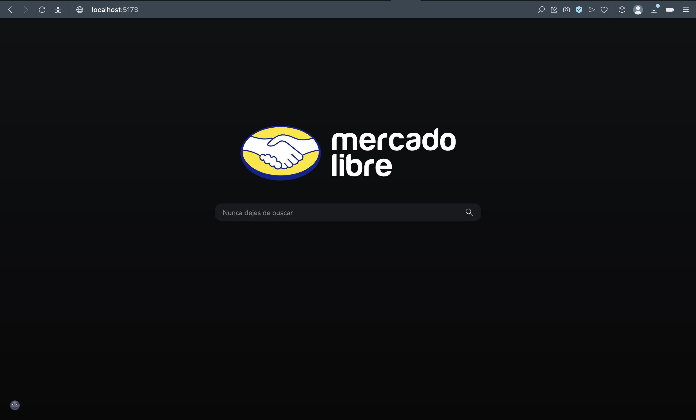

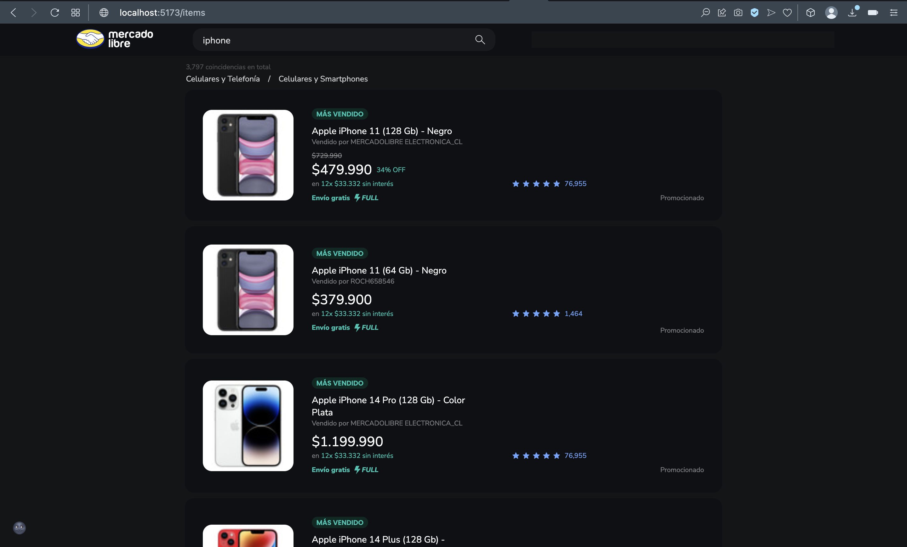

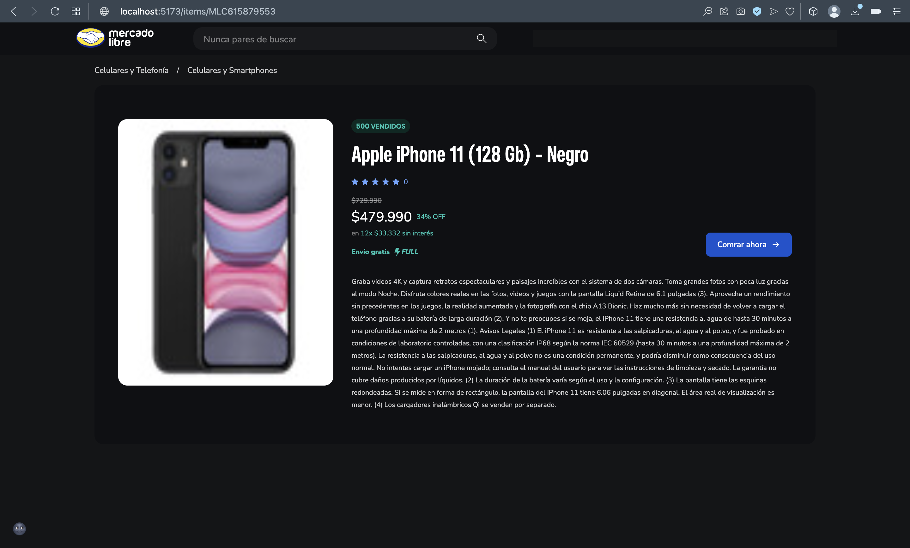
